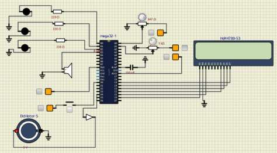
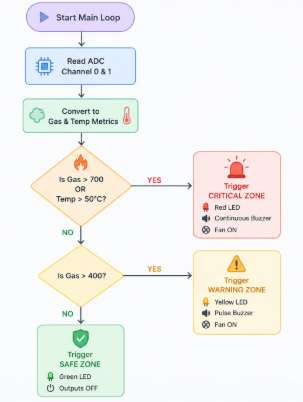
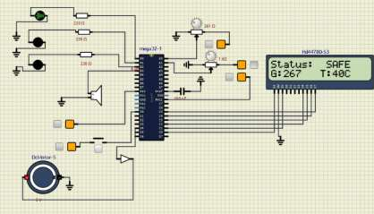
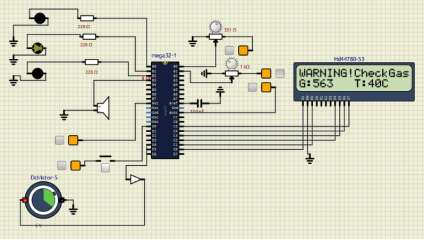
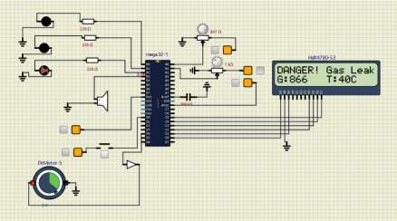

# Smart Industrial Gas Leakage Detection and Safety System

An embedded safety monitoring system built on the **ATmega32 microcontroller** that detects combustible gas leaks and abnormal temperature levels in real time, then automatically triggers visual, audio, and ventilation responses. Developed as a semester project for an Embedded Systems course.

## Overview

The system continuously reads two sensors and classifies the environment into Safe, Warning, or Danger states, displaying live status on a 16x2 LCD.

| Sensor | Purpose |
|---|---|
| MQ-2 Gas Sensor | Detects combustible gas / smoke concentration |
| LM35 Temperature Sensor | Measures ambient temperature |

Based on sensor readings, the system activates:
-  Green /  Yellow /  Red LED indicators
- A buzzer for audible alerts
- An exhaust fan for automatic ventilation
- An emergency stop button (hardware interrupt) that immediately halts all outputs

## System Architecture

## Hardware Used

| Component | Quantity | Purpose |
|---|---|---|
| ATmega32 Microcontroller | 1 | Main controller |
| MQ-2 Gas Sensor | 1 | Gas detection |
| LM35 Temperature Sensor | 1 | Temperature measurement |
| 16x2 LCD | 1 | Status display |
| Green / Yellow / Red LEDs | 1 each | Status indication |
| Buzzer | 1 | Audio alert |
| DC Fan | 1 | Ventilation |
| Push Button | 1 | Emergency stop |
| 220Ω Resistors | 3 | LED current limiting |
| 10kΩ Resistor | 1 | Pull-up resistor |

## How It Works

1. The ADC continuously samples the gas and temperature sensors.
2. Readings are compared against fixed thresholds (gas > 400 = warning, gas > 700 or temp > 50°C = danger).
3. Outputs (LEDs, buzzer, fan, LCD) update according to the current state.
4. Pressing the emergency button triggers a hardware interrupt that immediately shuts down all outputs.

## Simulation Results

Tested and verified in **SimulIDE**:

**Safe condition:**

**Warning condition:**

**Danger condition:**

## Known Limitations

- **State flickering near thresholds:** Small sensor fluctuations near boundary values (e.g. gas ≈ 400) can cause rapid switching between states. Hysteresis would resolve this in a future version.
- **Emergency stop does not require a confirmed second press to resume** — the LCD message "Press to Reset" is currently informational only; the system auto-resumes after a fixed delay rather than waiting for explicit button confirmation.
- **Gas readings are raw ADC values (0–1023), not a true percentage** — despite being labeled as such in variable naming, no percentage conversion is currently applied.

## Future Improvements

- Add hysteresis to reduce threshold flickering
- PWM-based fan speed control
- EEPROM-based hazard logging
- GSM/Wi-Fi module for remote alerts
- IoT-based real-time cloud monitoring

## Full Report

📄 [Read the full project report](assets/Gas_Leakage%20System%20Report.pdf)

## Tech Stack

- **Language:** Embedded C
- **Microcontroller:** ATmega32 (AVR)
- **Simulation:** SimulIDE Design Suite
